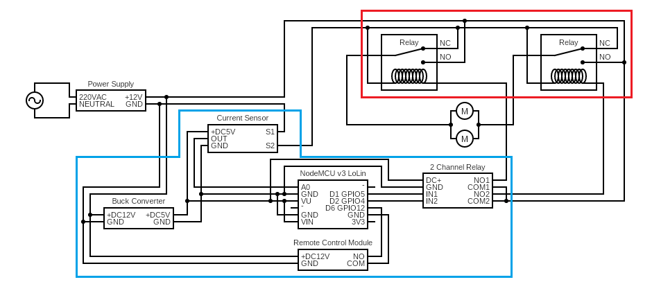
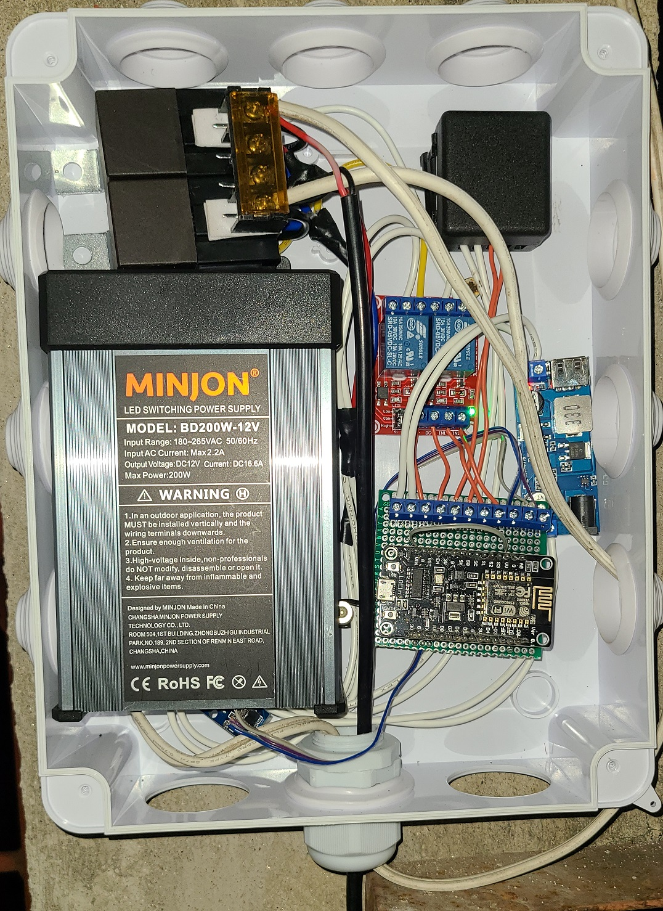
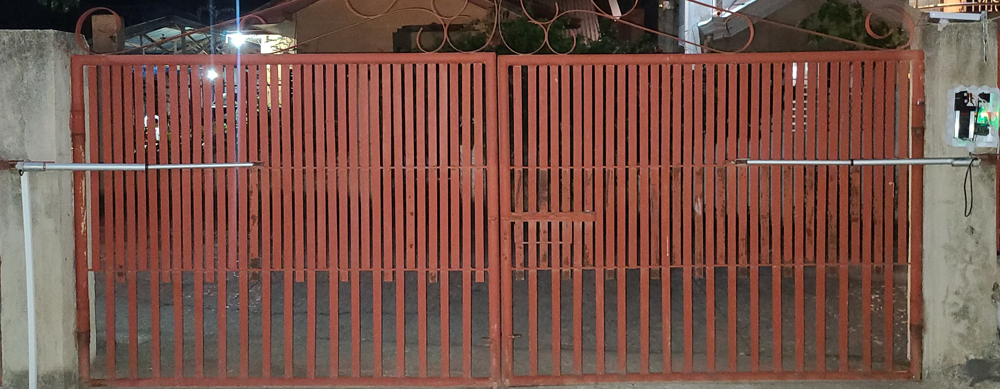

# Remote-Controlled Gate Opening and Closing System

A simple remote-controlled gate opening and closing system.

## Bill of Materials

| Pcs | Item                   | Notes/Specs                                                     |
| :-- | :--------------------- | :-------------------------------------------------------------- |
| 2   | Linear Actuator        | 12V 400 N 25mm/s. Controls the opening/closing of the gate      |
| 1   | Power Supply           | 220V AC - 12V DC, 16A. Match this based on your actuator specs  |
| 1   | NodeMCU ESP8266        | Any MCU will do as long as it has 3 GPIO pins and 1 ADC pin     |
| 1   | 2-Channel Relay Module | 5V. Will be controlled by NodeMCU. Will control the auto relays |
| 2   | Automotive Relay       | Controls the Linear Actuators                                   |
| 1   | Buck Converter         | 12V to 5V. Powers the MCU and Relay                             |
| 1   | Remote Control Module  | 1 Channel only needed                                           |
| 1   | Project Box            | Must be weatherproof                                            |

## Schematic

The circuit looks complex but that's because I didn't arrange the components properly. I marked the
control circuit as blue and the driver circuit as red.

### Driver Circuit

### Control Circuit

The control circuit is made up of:

-   Buck Converter - this steps down the 12V to 5V which will power the rest of the control circuit
-   Current Sensor - this is what is used to indirectly detect obstacles during opening or closing of the gate
-   Remote Control Module - this is what will receive the remote button click and trigger the opening and closing of the gate
-   2 Channel Relay - this is what will control driver relays
-   NodeMCU v3 Lolin - this will control the remote of the gate and ensure the proper logic of the circuit

Originally, I was planning to not use the NodeMCU at all as the driver circuit can directly be controlled
using the relay found inside the Remote Control Module. However, I went against this as I was too lazy to find
a way to measure the current passing through the linear actuators. It's also an indirect way of detecting whether
there are obstacles stopping the opening or closing of the gate. I also wanted to disengage the driver relays
entirely after one minute of inactivity so that it will wear out less often.

Improvements that can be made:

-   GPIO12 is an interrupt relay. This means that I can put the NodeMCU to sleep after one minute to increase its life.
-   Find an analog way of detecting current overload of the actuators so that I can get rid of the current sensor.
-   The linear actuators that I bought is only rated IP54, which means that although it can handle rain and dust, it's not
    entirely dustproof and waterproof.
-   I am well aware that I am shorting VIN to VU. This was an oversight when I was soldering the circuit. Seems like you need to
    power the MCU using VU. The 5V rail was attached to VIN but VIN needs more than 5V so that it can step it down to 5(?) or 3V3(?).
    I did a quick fix of this by shorting VIN and VU with a wire.

## Actual

This is the constructed circuit diagram inside the project box.

This is what the gate looks like with the linear actuators attached to it. Thanks to dad for the assistance with
drilling and attaching the anchors to the posts.

## References

-   Schematic was created using [circuit-diagram.org](https://crcit.net/c/0e136249ca9b4e7298457ac0507ae33f)
-   [NodeMCU Pinout](https://cyberblogspot.com/nodemcu-v3-esp8266-pinout-and-configuration/)
